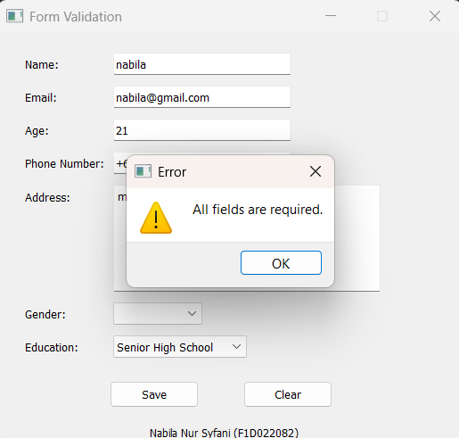
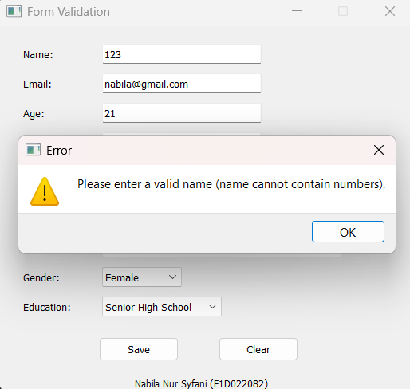
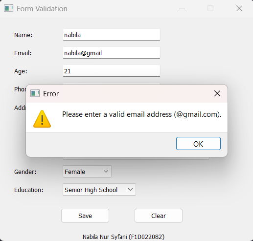
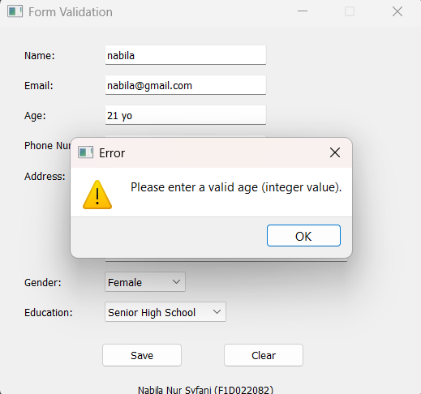
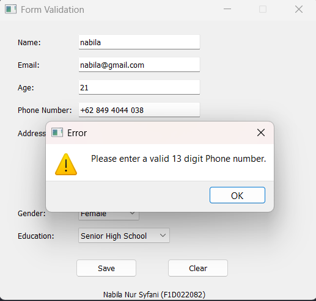
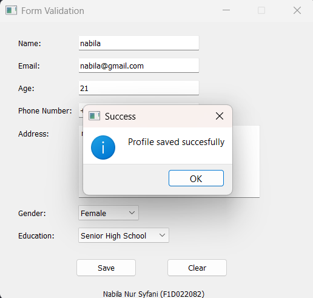

# pv25-week5
<table align="center">
  <tr>
    <td align="center">
       
      <b>Output ketika salah satu atau semua input kosong</b>
    </td>
    <td align="center">
       
      <b>Output ketika nama tidak valid</b>
    </td>
  </tr>
  <tr>
    <td align="center">
       
      <b>Output ketka email tidak valid</b>
    </td>
    <td align="center">
       
      <b>Output ketka umur tidak valid </b>
    </td>
  </tr>
  <tr>
    <td align="center">
       
      <b>Output ketka nomor hp tidak valid </b>
    </td>
    <td align="center">
       
      <b>Output ketka data tersimpan</b>
    </td>
  </tr>
</table>
